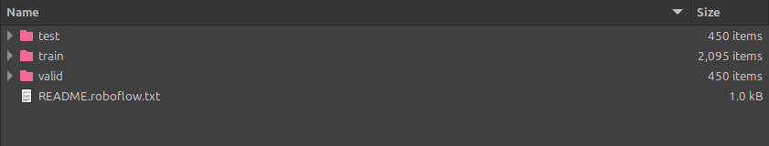

# Aerial_Object_Detection

## Introduction

This is a short project applying the Faster R-CNN object detection model to a dataset of aerial photographs. It mostly follows [this](https://pytorch.org/tutorials/intermediate/torchvision_tutorial.html) tutorial from the PyTorch documentation.

## Dataset

The dataset is from Kaggle can be found [here](https://www.kaggle.com/datasets/kailaspsudheer/tiny-object-detection). It cossists of 3000 satellite images labelled with bounding boxes for vehicles.

## Installation:

Ensure that Python 3.10 is installed on your system and install the dependencies via:

```
pip install -r requirements.txt
```

If you have a different version of Python installed then consider creating a new conda enviroment.

Once the requirements are set up, download the dataset from the link above and extract the content to the folder `Datasets`. Ensure the file structure within the folder looks like this:



Then, run all the cells in the notebook, the model will be trained and the parameters will be saved in the directory `weights`.
